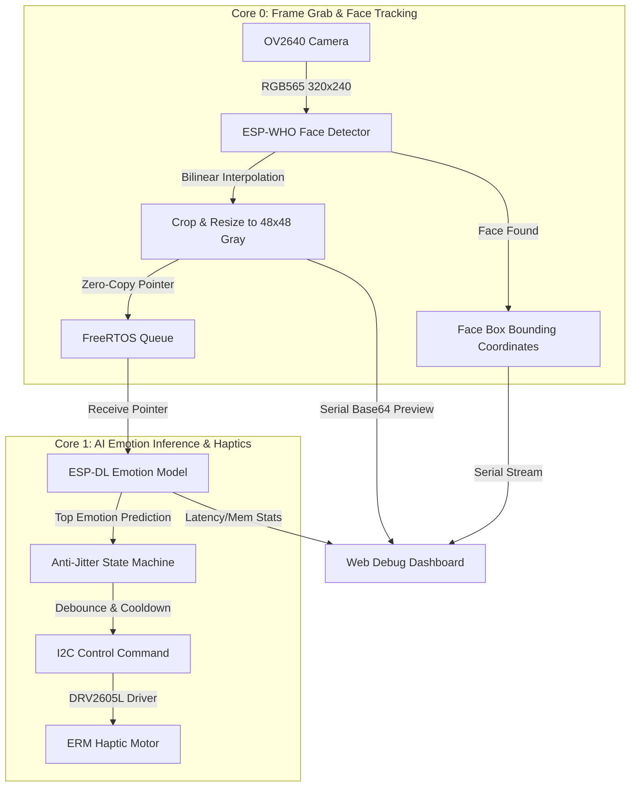

# Intro-Vision (v0.4.0)

Intro-Vision is a low-cost, fully offline wearable AI assistant designed to provide social auxiliary support via tactile-encoded feedback. Operating entirely on the edge, the system detects human faces, recognizes their micro-expressions in real-time, and translates them into distinct vibration patterns using a haptic driver, protecting user privacy with zero data transmission.

---

## ⚙️ System Architecture

The firmware utilizes the dual-core architecture of the **ESP32-S3** to pipeline compute-intensive tasks without dropping frames.



### 1. Dual-Core Asynchronous Pipeline
*   **Core 0 (Face Capture & Preprocessing)**: Acquires camera frames in RGB565 format, runs the lightweight ESP-WHO face detector (`MSRMNP_S8_V1`), clips the bounding region, and scales it down to $48 \times 48$ grayscale. The resulting pointer is sent to Core 1 using a zero-copy queue to bypass memory reallocation overhead.
*   **Core 1 (AI Inference & Control)**: Dequeues the image pointer, runs the customized `SimpleCNN` model using ESP-DL, and feeds the predicted class into the debounce state machine.

### 2. Anti-Jitter State Machine (防抖與冷卻機制)
To prevent erratic vibrations caused by momentary facial expression changes:
*   **Debounce (100ms / 200ms)**: The target emotion must sustain continuously for a configured threshold (default: 200ms) before triggering physical haptic feedback.
*   **Cooldown (5 Seconds)**: Once a pattern finishes playing, the actuator is locked in a mute/standby state for 5 seconds, preventing sensory fatigue and secondary user anxiety.

---

## ⚡ Model Acceleration & INT8 Quantization

Deploying deep learning models on resource-constrained microcontrollers (SRAM ~512KB) requires hardware-level optimization:

1. **INT8 Quantization**: The PyTorch FP32 model is converted to ONNX and quantized into 8-bit integers (`INT8`) using ESP-DL calibration. This reduces the binary size by **~75%** with negligible accuracy loss.
2. **DSP Vector Instruction Set Activation**: The model arrays are compiled with strict **16-byte alignment** (`__attribute__((aligned(16)))`). This aligns the model buffers with the ESP32-S3's **Xtensa® LX7 DSP Vector Extensions**, speeding up matrix multiplications by several orders of magnitude.

---

## 📦 Model Evaluation Benchmarks

Below is the comparative evaluation of the CNN variants trained and tested for this project.

### Table 1: Model Accuracy, Performance & Latency
| Candidate Model Name | Params | MACs (Mult-Adds) | PyTorch Acc | ESPDL Sim Acc (INT8) | Raw Benchmark Latency | Est. Throughput | Integrated Inference Time |
| :--- | :---: | :---: | :---: | :---: | :---: | :---: | :---: |
| **🥇 simple_cnn_2stage_16channels** | **53,815** (Min) | 18.91 M | 71.61% | **71.81%** | **30.04 ms** (Fastest) | **33.29 FPS** (Highest) | **30 ms ~ 60 ms** (Best) |
| **simple_cnn_3stage_8channels** | 64,847 | **8.13 M** (Lowest) | 71.06% | 71.19% | 47.33 ms | 21.13 FPS | 70 ms ~ 80 ms |
| **simple_cnn_4stage_8channels** | 268,591 | 11.45 M | **74.22%** (Highest)| **74.22%** (Highest) | 69.47 ms | 14.39 FPS | 120 ms ~ 170 ms |
| **simple_cnn_3stage_16channels** | 257,559 | 32.18 M | 73.24% | 73.53% | 151.04 ms | 6.62 FPS | 350 ms ~ 550 ms |
| **simple_dwcnn_3stage_16channels** | 56,167 | 9.42 M | 65.74% | 65.87% | 69.47 ms | 14.39 FPS | 120 ms ~ 160 ms |
| **simple_dwcnn_3stage_32channels** | 210,119 | 35.36 M | 73.66% | 73.37% | 374.89 ms | 2.67 FPS | 470 ms ~ 540 ms |
| **simple_dwcnn_4stage_16channels** | 220,839 | 13.34 M | 70.01% | 69.95% | 108.69 ms | 9.20 FPS | 170 ms ~ 230 ms |

### Table 2: Memory Footprint on ESP32-S3
| Candidate Model Name | Static SRAM Used | Peak SRAM Used (Min Ever) | PSRAM Used |
| :--- | :---: | :---: | :---: |
| **🥇 simple_cnn_2stage_16channels** | **14.2 KB** (Lowest) | **26.6 KB** (Lowest) | 136.8 KB |
| **simple_cnn_3stage_8channels** | 19.8 KB | 39.9 KB | **117.8 KB** (Lowest) |
| **simple_cnn_4stage_8channels** | 24.6 KB | 51.3 KB | 322.9 KB |
| **simple_cnn_3stage_16channels** | 19.8 KB | 39.9 KB | 342.5 KB |
| **simple_dwcnn_3stage_16channels** | 24.6 KB | 51.3 KB | 322.9 KB |
| **simple_dwcnn_3stage_32channels** | 29.1 KB | 62.1 KB | 381.6 KB |
| **simple_dwcnn_4stage_16channels** | 39.3 KB | 86.2 KB | 331.0 KB |

**Key Takeaways**:
* **Optimal Deploy Target**: The `2stage_16channels` model provides the best responsiveness (**33 FPS / 30ms latency**) while keeping SRAM footprint under 15KB.
* **Standard Conv vs DW-Conv**: Depthwise Separable Convolution (DWCNN) suffers from memory access bottlenecks on the microcontroller. While their parameter size is low, their physical latency is significantly higher than standard convolutions (up to 374ms).

---

## 🎮 Tactile Feedback Mapping

The system encodes predictions into distinct haptic profiles on the DRV2605L driver:

| Detected Emotion | DRV2605L Library Pattern | Physical Haptic Feel |
| :--- | :--- | :--- |
| **😮 Surprise (驚訝)** | Quadruple Click | 4 consecutive sharp pulses (400ms) |
| **😨 Fear (恐懼)** | Triple Heartbeat | 3 pulsing heartbeat sensations (1000ms) |
| **😢 Sadness (悲傷)** | Transition Ramp Down | Slow, smooth fading release (1000ms) |
| **😠 Anger (生氣)** | Double Strong Buzz | Long, intense double vibration (1500ms) |
| **😊 Happiness (喜悅)** | Gentle Double Pulse | 2 warm, soft taps (400ms) |
| **🤢 Disgust (厭惡)** | Multiple Rough Buzz | Prolonged coarse, grinding friction (2000ms) |
| **😐 Neutral (平靜)** | Silent | Off (Muted to avoid user annoyance) |

---

## 🛠️ Environment Setup

We use [Pixi](https://pixi.sh/) to manage both Python runtimes and IDF toolchains deterministically.

### 1. Installation
```bash
# 1. Install Pixi package manager
curl -fsSL https://pixi.sh/install.sh | bash
source ~/.bashrc

# 2. Clone repository & submodules (esp-who custom components)
git clone --recursive <repository_url>
cd intro-vision

# 3. Pull Python packages & compiler bindings automatically
pixi install
```

---

## 🚀 One-Click Commands Workflow

### Phase 1: Train & Export Models
Modify training configs inside [config.toml](file:///home/eender/Workspace/Project/intro-vision/emotion_detect/config.toml).
*   **Run Training Pipeline**:
    ```bash
    pixi run emo_train
    ```
*   **One-Click Model Export** (Converts `.pt` -> `.onnx` -> Simplifies -> `.espdl` in one step):
    ```bash
    pixi run emo_export
    ```

### Phase 2: Firmware Build & Flash
Connect your ESP32-S3 via USB-to-UART.
*   **Sync Model to Firmware**:
    ```bash
    pixi run espdl_to_firmware
    ```
*   **Install Target Toolchain** (Run once at setup):
    ```bash
    pixi run esp_install
    ```
*   **Build & Flash to Board** (921600 Baud console output):
    ```bash
    pixi run esp_build
    # Flash and monitor logs
    pixi run esp_flash_m
    ```

### Phase 3: Hardware Diagnostics & Speed Benchmarks
*   **Run On-Device Profiling**:
    ```bash
    pixi run test_perf_build
    pixi run test_perf_flash
    ```

---

## 🖥️ Web Debug Dashboard

Monitor camera stream, real-time bounding boxes, latency statistics, and active haptic alerts.
```bash
pixi run debug_ui
```
Open **`http://localhost:8000`** on your browser, select **921600** in the Baud Rate dropdown, and click **Connect**.

---

## 📦 Released Assets & Download
Trained models (`best_model.pt`, `model.onnx`, `model.espdl` and evaluation profiles) are compiled inside `intro_vision_models_v0.4.0.zip`. You can download the zip directly from the Github Releases page to bypass the local PyTorch training phase and flash the pre-configured models straight to your ESP32-S3 hardware.
